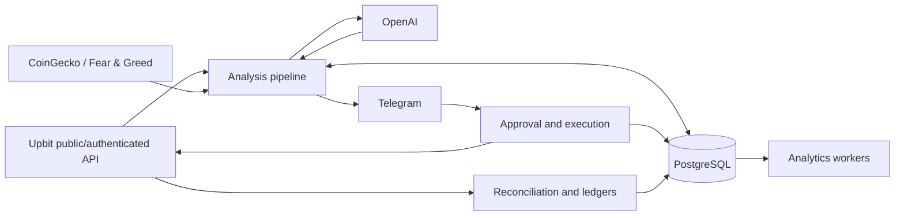
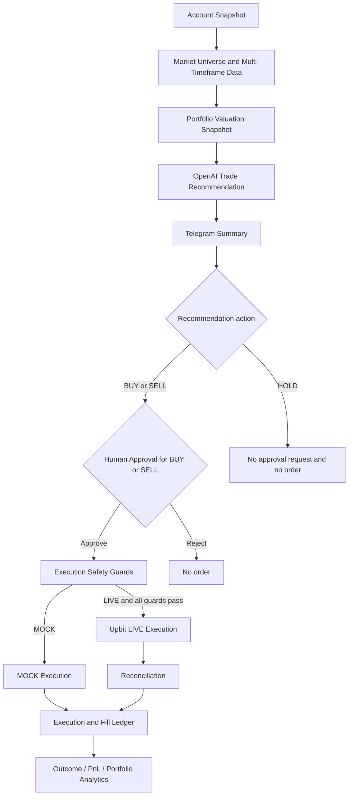
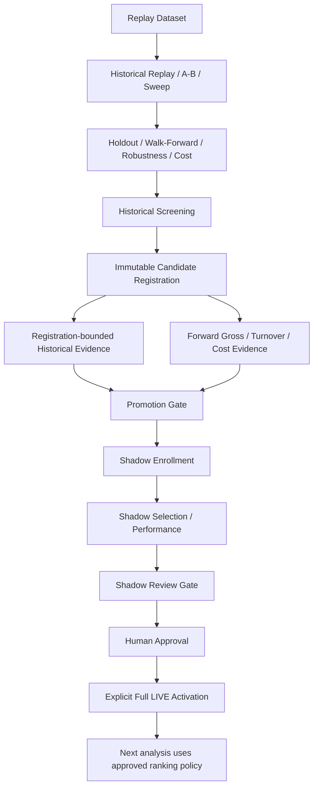

# Crypto Trading Bot

시장과 계좌 데이터를 수집해 거래 후보를 ranking하고, OpenAI가 `BUY` / `SELL` / `HOLD`와 거래 비율을 판단하되, 실제 `BUY` / `SELL`은 Telegram에서 사람의 명시적 승인을 받은 뒤에만 Upbit 주문 경로로 진행하는 human-in-the-loop crypto trading system입니다.

이 저장소의 중심은 실제로 동작하는 Python trading/research engine입니다. 단순한 GPT 호출 예제가 아니라 시장 선택, 승인, 주문, reconciliation, ledger, 성과 분석과 전략 승격을 PostgreSQL에 추적 가능한 경계로 분리합니다.

## 핵심 특징

- Upbit public/authenticated API 기반 시장 데이터, 계좌 조회, 주문 실행 및 상태 조정
- STATIC 또는 DYNAMIC Market Universe와 15m/1h/4h/1d Multi-Timeframe 분석
- OpenAI Structured Output으로 candidate의 market/action과 `trade_ratio`를 선택하고, exact KRW amount 또는 coin quantity는 애플리케이션이 계산
- Telegram Human Approval과 MOCK/LIVE 실행 경계
- 건별·일별 한도, idempotency, Order Chance, ambiguous order reconciliation
- execution/fill ledger와 recommendation, bot PnL, portfolio performance의 분리된 분석
- historical, forward, shadow evidence를 거치는 명시적 ranking policy 승격 절차
- Docker Compose, Alembic, Pytest, Ruff, 수동 Production CD 기반 운영 검증

## 목차

- [설계 원칙](#설계-원칙)
- [시스템 아키텍처](#시스템-아키텍처)
- [거래 흐름](#거래-흐름)
- [Repository 구조](#repository-구조)
- [기술 스택](#기술-스택)
- [핵심 기능](#핵심-기능)
- [Strategy Research와 Policy Promotion](#strategy-research와-policy-promotion)
- [Runtime services](#runtime-services)
- [안전 기본값](#안전-기본값)
- [Production과 CI/CD](#production과-cicd)
- [Quick Start](#quick-start)
- [설정](#설정)
- [개발과 검증](#개발과-검증)
- [문서](#문서)

## 설계 원칙

### Recommendation과 execution을 분리합니다

OpenAI는 최종 candidate 전체를 비교해 행동, 시장, `trade_ratio`를 반환합니다. 정확한 KRW 금액이나 매도 수량은 잔고, 최소 주문금액, 건별 상한, 일별 BUY 잔여 한도를 사용해 애플리케이션이 계산합니다. 모델 출력이 candidate membership, eligibility, candle sufficiency, 잔고 또는 비율 계약을 위반하면 애플리케이션이 `HOLD`로 안전하게 보정합니다.

### Human Approval은 실제 주문의 필수 경계입니다

예약 분석은 추천과 Telegram 승인 요청을 만들 수 있지만 주문을 만들지는 않습니다. `BUY` / `SELL` 추천은 유효한 Telegram 승인 뒤에만 실행 서비스로 전달됩니다. `HOLD`는 정상적인 결과이며 거래를 억지로 만들지 않습니다.

### 배포, 정책 승인, 정책 활성화와 주문은 서로 다릅니다

```text
Code deployment != Human policy approval
Human policy approval != Full LIVE activation
Full LIVE activation != Upbit order
```

코드 배포만으로 research candidate가 runtime ranking에 적용되지 않습니다. 승인된 정책도 운영자가 별도의 Full LIVE activation을 명시적으로 기록해야 다음 Market Universe 분석부터 사용됩니다. 이 activation은 ranking policy만 바꾸며 주문을 생성하지 않습니다.

### 연구 지표와 실제 손익을 섞지 않습니다

```text
research gross market movement
!= recommendation outcome
!= bot realized PnL
!= account-level portfolio performance
```

Scenario sweep이나 backtest는 기술적 evidence일 뿐 최적 정책, 통계적 유의성, 미래 수익 또는 자동 LIVE promotion을 뜻하지 않습니다.

## 시스템 아키텍처



한 번의 분석은 UUID `pipeline_run_id`를 subprocess 전체에 전달합니다. Account snapshot, 선정 universe, candles/features, portfolio valuation과 recommendation은 같은 pipeline identity로 연결됩니다. PostgreSQL은 거래 상태뿐 아니라 후보 선정 근거, approval, execution attempt, order/fill, research evidence와 policy provenance를 보존합니다.

상세한 module boundary, persistence와 worker interaction은 [시스템 아키텍처](docs/ARCHITECTURE.md)를 참고하세요.

## 거래 흐름

분석 pipeline과 승인 listener/order execution은 별도 runtime입니다.



LIVE execution은 현재 Upbit 전용입니다. Telegram approval, execution mode, explicit LIVE flags, confirmation string, market eligibility, 잔고·ticker 재검증과 주문 한도를 모두 통과해야 합니다. 응답이 모호하면 새 주문을 반복 생성하지 않고 identifier 기반 조회와 reconciliation으로 상태를 확정합니다.

## Repository 구조

```text
crypto-trading-bot/
├── trading-engine/   # 구현된 Python trading/research engine
├── backend/          # Spring Boot API backend 계획용 placeholder
├── frontend/         # React + TypeScript frontend 계획용 placeholder
├── docs/             # architecture, research, policy, operations 문서
├── scripts/          # root 운영·백업·배포 shell script
├── docker-compose.yml
└── .env.example
```

Python package와 CLI module은 각각 `crypto_trading_bot`과 `scripts.*`입니다. Python, uv, Alembic 명령은 `trading-engine/`에서 실행하고 Docker Compose와 root shell script는 repository root에서 실행합니다. `.env`와 `.secrets/`도 root에 위치합니다.

## 기술 스택

| 영역 | 현재 사용 기술 |
| --- | --- |
| Runtime | Python 3.14, uv |
| Persistence | PostgreSQL 17, SQLAlchemy, Alembic |
| Configuration | Pydantic Settings, file-based secrets |
| Exchange | Upbit public/authenticated API, httpx |
| Market context | CoinGecko, Alternative.me Fear & Greed |
| Decision | OpenAI API, Structured Output |
| Approval/alerts | python-telegram-bot |
| Scheduling | APScheduler, PostgreSQL advisory lock |
| Runtime | Docker, Docker Compose |
| Quality | Pytest, Ruff, GitHub Actions |

## 핵심 기능

### Market Data와 Universe

- `STATIC`: `ALLOWED_MARKETS`를 사용하는 하위 호환 기본 모드
- `DYNAMIC`: Upbit KRW market discovery, warning/caution/blocklist와 24시간 KRW 거래대금 필터, liquidity prefilter, deterministic heuristic ranking
- 15m, 60m, 240m, day candles와 SMA/EMA/RSI/MACD/ATR/volatility/drawdown 등 compact feature
- orderbook spread와 volume confirmation
- Top N 밖의 실제 보유 종목도 `HELD` candidate로 유지하여 SELL 판단 가능
- exchange market-data abstraction과 Upbit adapter; LIVE order execution은 Upbit 전용

Ranking은 candidate 수를 줄이는 heuristic이며 수익성을 보장하지 않습니다. 최종 Top N과 holdings는 OpenAI가 다시 상대 비교합니다. DYNAMIC의 신규 BUY 후보와 data-collection용 holding은 구분되며, 경보가 있는 holding은 BUY가 차단되어도 청산 검토를 위해 남습니다.

### AI Recommendation

기본 모델은 설정의 `gpt-5.6-sol`, reasoning effort는 `medium`입니다. Context에는 account, position, candidate provenance, liquidity, orderbook, Multi-Timeframe feature, CoinGecko global data와 sentiment가 포함될 수 있습니다. CoinGecko identity가 명시되지 않은 asset을 symbol만 보고 추측하지 않습니다.

모델은 candidate 밖 market을 선택할 수 없고 `BUY`는 `buy_eligible=true`, `SELL`은 실제 holding이면서 `sell_eligible=true`인 candidate만 가능합니다. 반환값은 `trade_ratio`이며 exact order amount/quantity는 애플리케이션 책임입니다.

### Order Execution과 안전성

- `ORDER_EXECUTION_MODE=MOCK` 기본값과 MOCK/LIVE service 분리
- `LIVE_ORDER_ENABLED`, confirmation string과 Upbit-only 검증
- static allowlist 및 별도 `LIVE_DYNAMIC_MARKET_ENABLED` guard
- recommendation/user/exchange/market/pipeline universe provenance 검증
- Telegram approval, recommendation/attempt/order idempotency
- 건별 `MAX_ORDER_AMOUNT_KRW` 및 일별 `DAILY_MAX_ORDER_AMOUNT_KRW` BUY limit
- 실행 직전 ticker, balance, 거래지원과 BUY warning/caution 재검증
- 선택적 Upbit Order Chance GET preflight
- ambiguous response의 identifier reconciliation과 `LIVE_UNKNOWN` 보수 처리

첫 실제 주문 전에는 반드시 [제한적 LIVE 런북](docs/LIVE_RUNBOOK.md)을 따르세요.

### Reliability와 ledger

`live-order-reconciliation-worker`는 기존 LIVE 주문을 GET으로 조회해 상태를 동기화하며 주문 생성·재시도·취소를 하지 않습니다. Execution summary는 같은 Upbit 응답에서 얻은 coherent quantity/funds pair를 사용하고 fill은 unique identity로 중복을 방지합니다. Operational Alerting은 stale/unknown order와 pipeline failure를 DB-backed outbox 방식으로 추적할 수 있습니다.

### Analytics의 경계

| 영역 | 의미 | 실제 trading PnL 여부 |
| --- | --- | --- |
| Recommendation Outcome | AI 추천 이후 action-aligned 시장 움직임 | 아니오 |
| Research Candidate Outcome | ranking pool 후보의 future gross market movement | 아니오 |
| Bot Trading PnL | bot LIVE fill 기반 FIFO realized accounting | 예, bot-attributed |
| Portfolio Valuation | account asset의 시점별 KRW valuation | 계좌 가치 |
| Portfolio Performance | 완료된 외부 입출금을 분리한 account-level performance | 계좌 성과 |

Account Activity ledger는 Upbit 종료 주문·입금·출금을 authenticated read-only로 동기화합니다. Portfolio Performance의 완료 cash flow 시각은 `completed_at`이며, 평가 불가능한 자산이나 불완전 source는 0으로 만들지 않고 `PARTIAL`로 처리합니다.

## Strategy Research와 Policy Promotion

Historical sweep 결과만으로 LIVE ranking policy를 변경하지 않습니다.



Replay와 validation은 DB에 frozen된 context와 outcome을 사용합니다. Historical/forward 경계는 registration timestamps와 snapshot watermarks로 고정하며, as-of/ceiling과 immutable signature를 통해 서로 다른 시점의 evidence가 섞이는 것을 막습니다. Shadow selection은 실제 runtime 주문을 바꾸지 않고 enrollment 이후 데이터만 평가합니다.

Human approval은 immutable audit row를 만드는 단계이고 activation은 아닙니다. Full LIVE activation은 승인 signature를 다시 검증해 다음 분석의 ranking policy만 변경합니다. 종료는 activation row를 수정하지 않고 append-only termination event를 추가하며 runtime은 BASELINE으로 돌아갑니다. 과거 Canary migration은 현재 runtime architecture가 아닙니다.

- 연구 방법과 CLI: [Strategy Research](docs/STRATEGY_RESEARCH.md)
- Candidate부터 Full LIVE까지: [Policy Promotion](docs/POLICY_PROMOTION.md)

## Runtime services

| Service | 역할 | 기본 동작 |
| --- | --- | --- |
| `postgres` | PostgreSQL 17 | 상시, host port 미공개 |
| `migrate` | Alembic `upgrade head` | 1회 실행 후 종료 |
| `ai-trade-analysis` | 분석 pipeline 1회 실행 | `manual` profile |
| `ai-trade-scheduler` | 설정 시각에 pipeline 실행 | `scheduler` profile |
| `telegram-listener` | 승인/거절 callback과 승인 주문 실행 | 상시 |
| `mock-order-retry-worker` | 실패 MOCK execution과 알림 재시도 | 상시 |
| `live-order-reconciliation-worker` | 기존 LIVE order GET reconciliation | 상시, flag로 제어 |
| `account-activity-sync-worker` | Upbit account activity read-only sync | 상시 container, 기본 idle |
| `bot-trading-pnl-worker` | DB-only FIFO PnL | 상시 container, 기본 idle |
| `portfolio-performance-worker` | Account performance; 필요 시 Upbit public candle 조회 | 상시 container, 기본 idle |
| `operational-alert-worker` | DB + Telegram operational alerts | 상시 container, 기본 idle |
| `recommendation-outcome-worker` | Recommendation/Research outcome 및 opt-in Shadow selection cycle | 상시 container, 기본 idle |

Compose는 worker별 secret scope를 줄입니다. 예를 들어 Bot PnL과 Portfolio Performance는 DB secret만, Operational Alert는 DB와 Telegram, Account Activity는 DB와 Upbit read credential을 받습니다. Container가 실행 중이라는 사실과 기능 flag가 활성화됐다는 사실은 다릅니다.

## 안전 기본값

`.env.example`의 rollout 기본값은 기존 운영을 자동으로 바꾸지 않습니다.

```dotenv
TRADING_MODE=AI_APPROVAL
ORDER_EXECUTION_MODE=MOCK
LIVE_ORDER_ENABLED=false
LIVE_ORDER_CONFIRMATION=
MARKET_UNIVERSE_MODE=STATIC
LIVE_DYNAMIC_MARKET_ENABLED=false
LIVE_ORDER_CHANCE_PREFLIGHT_ENABLED=false
```

Analytics/account worker도 대부분 opt-in flag가 `false`입니다. 실제 LIVE 활성화 절차와 값은 일반 Quick Start가 아니라 [Production LIVE](docs/PRODUCTION_LIVE.md)와 [LIVE Runbook](docs/LIVE_RUNBOOK.md)의 fail-closed 절차를 따릅니다.

## Production과 CI/CD

Production 배포는 push 자동배포가 아닙니다. `Deploy Production` workflow는 `workflow_dispatch` 전용이며 `confirmation=DEPLOY`, `main`, exact `github.sha`, `origin/main` 일치, verified known hosts와 serialized concurrency를 요구합니다. 서버 deploy script는 preflight·backup이 완료된 뒤 scheduler를 중지하고 fast-forward, image build, migration, runtime recreate와 `--production-live` 검증을 수행합니다. 자동 Git/DB rollback은 하지 않습니다.

CI는 Ubuntu 24.04에서 Python/uv locked dependency, PostgreSQL migration, Ruff format/lint, Pytest, shell syntax, Docker Compose config와 runtime image build를 검사합니다.

운영 절차는 [Operations](docs/OPERATIONS.md), 배포와 LIVE runtime은 [Production LIVE](docs/PRODUCTION_LIVE.md)가 source of truth입니다.

## Quick Start

### 1. 로컬 설정 준비 — repository root

실제 credential을 저장소에 넣지 마세요. `.env.example`을 참고해 Git ignored `.env`와 `.secrets/`를 준비합니다. 자세한 file permission과 secret 이름은 Operations 문서를 따릅니다.

### 2. PostgreSQL 실행 — repository root

```bash
docker compose -f docker-compose.yml -f docker-compose.local.yml up -d postgres
```

`docker-compose.local.yml`만 개발용으로 `5432`를 host에 노출합니다. 기본 Production-like Compose는 DB port를 외부에 공개하지 않습니다.

### 3. Python 환경과 migration — `trading-engine/`

```bash
cd trading-engine
uv sync --dev --locked
uv run alembic upgrade head
```

### 4. 검증

```bash
uv run pytest -q
uv run ruff format --check .
uv run ruff check .
```

외부 API diagnostic, Telegram 발송, authenticated Upbit check와 주문 관련 CLI는 Quick Start에 포함하지 않습니다. 목적과 safety boundary를 확인한 뒤 운영 문서의 명령만 사용하세요.

## 설정

설정의 source of truth는 [.env.example](.env.example)과 [`Settings`](trading-engine/crypto_trading_bot/config/settings.py)입니다.

| Category | 주요 내용 |
| --- | --- |
| Database | host/port/name/user와 password file |
| OpenAI | API key file, model, reasoning effort |
| Telegram | bot token file, chat ID |
| Upbit | access/secret file, orderbook, private read/order access |
| Trading safety | execution mode, LIVE flags, confirmation, limits |
| Market Universe | STATIC/DYNAMIC, Top N, filters, timeframes |
| Analytics | account activity, outcome, PnL, portfolio, alert flags |
| Scheduler | enablement, KST schedule, startup behavior |

Compose는 secret을 `/run/secrets/` file로 제공합니다. `.env`와 `.secrets/`는 Git ignored이며 실제 값, chat ID, server address 또는 private key를 문서와 commit에 추가하면 안 됩니다.

## 개발과 검증

Python 개발 명령은 `trading-engine/`에서 실행합니다.

```bash
uv run pytest -q
uv run ruff format --check .
uv run ruff check .
uv run alembic heads
```

테스트는 실제 external API나 실제 주문에 의존하지 않습니다. CI는 전용 PostgreSQL service를 사용합니다. Root runtime 구성 확인은 repository root에서 실행합니다.

```bash
docker compose --profile manual --profile scheduler config --quiet
bash -n scripts/check_server_runtime_safety.sh
bash -n scripts/deploy_production.sh
bash -n scripts/backup_db.sh
```

## 문서

| 문서 | Source of truth |
| --- | --- |
| [Architecture](docs/ARCHITECTURE.md) | component, data flow, persistence, worker boundary |
| [Strategy Research](docs/STRATEGY_RESEARCH.md) | replay, validation, cost, evidence methodology와 CLI |
| [Policy Promotion](docs/POLICY_PROMOTION.md) | candidate → shadow → approval → Full LIVE lifecycle |
| [Operations](docs/OPERATIONS.md) | 일상 server/runtime operation과 diagnostics |
| [Production LIVE](docs/PRODUCTION_LIVE.md) | Production deployment와 LIVE runtime |
| [LIVE Runbook](docs/LIVE_RUNBOOK.md) | 첫 제한적 실제 주문 절차 |
| [Trading Engine](trading-engine/README.md) | engine 개발 명령과 directory boundary |

## Risk notice

이 프로젝트의 ranking, AI recommendation, replay와 performance report는 수익을 보장하지 않습니다. 암호화폐 거래에는 원금 손실, 유동성, 가격 급변, API·network·운영 장애 위험이 있습니다. LIVE 설정은 기본적으로 비활성화되어 있으며, 실제 주문 전에는 코드와 설정, database backup, exchange permission, 한도와 runbook을 운영자가 직접 검토해야 합니다.
