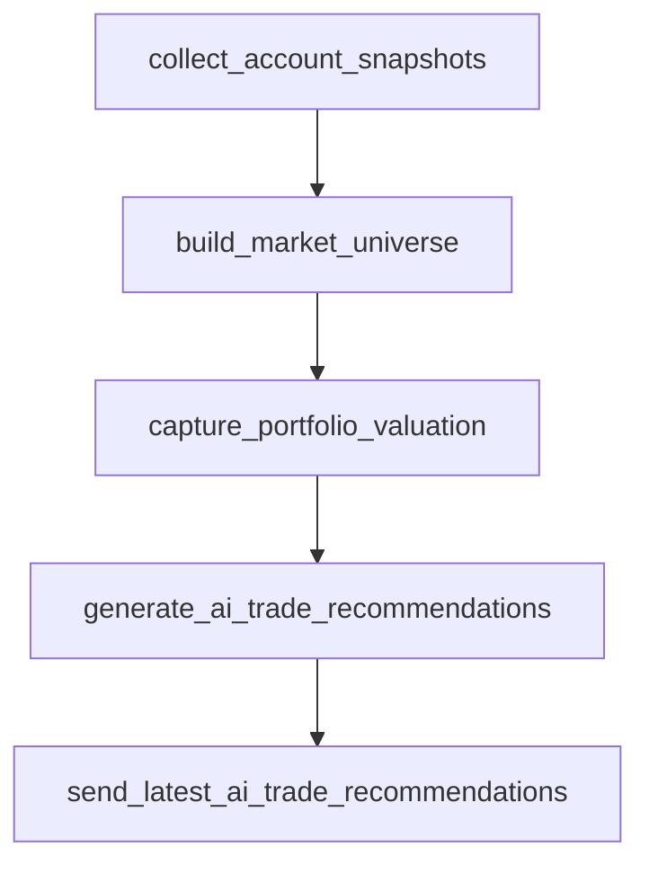
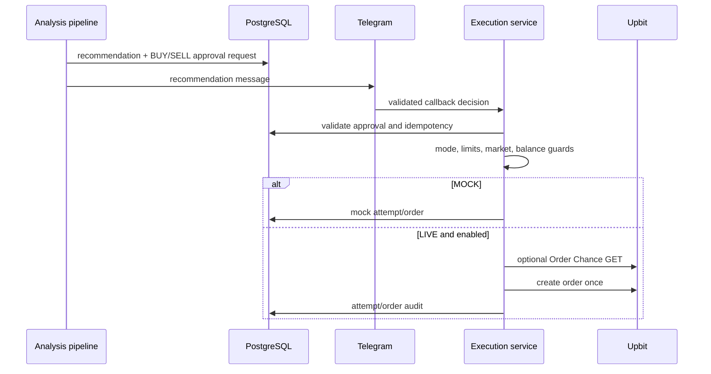

# 시스템 아키텍처

이 문서는 현재 구현된 component, data flow와 persistence boundary의 source of truth입니다. 운영 절차는 [OPERATIONS.md](OPERATIONS.md), 전략 연구는 [STRATEGY_RESEARCH.md](STRATEGY_RESEARCH.md), 정책 승격은 [POLICY_PROMOTION.md](POLICY_PROMOTION.md)를 참고하세요.

## Application boundary

| 경로 | 상태 | 책임 |
| --- | --- | --- |
| `trading-engine/` | 구현됨 | Python trading, analytics, research engine |
| `backend/` | 계획됨 | Spring Boot API placeholder |
| `frontend/` | 계획됨 | React/TypeScript placeholder |

Root에는 Compose, 운영 shell script, 문서, `.env.example`이 있습니다. Python package는 `trading-engine/crypto_trading_bot`, 실행 module은 `trading-engine/scripts`입니다.

## Package structure

| Package | 책임 |
| --- | --- |
| `analysis/` | indicator와 교체 가능한 ranking policy |
| `ai/` | OpenAI Structured Output와 response parsing |
| `config/` | Pydantic Settings와 file secret resolution |
| `db/` | SQLAlchemy model, session, advisory lock |
| `exchange/` | exchange market-data contract, Upbit adapter/client |
| `market_data/` | CoinGecko, Fear & Greed client |
| `notification/` | Telegram message와 callback integration |
| `operational/` | 안전한 오류 분류와 pipeline reporting |
| `services/` | universe, recommendation, order, analytics, research, policy lifecycle |

Market-data 분석 계층은 `ExchangeMarketDataProvider` contract를 사용하고 현재 adapter는 Upbit입니다. LIVE order execution은 의도적으로 Upbit 전용이며 market-data abstraction을 주문 계층까지 과도하게 확장하지 않습니다.

## Analysis pipeline

`scripts.run_ai_trade_analysis`는 실행마다 UUID `pipeline_run_id`를 만들고 다음 subprocess에 전달합니다.

각 단계가 실패하면 이후 단계는 실행하지 않습니다. 오류는 safe envelope로 분류해 operational alert를 저장·전달하며 자동 재주문이나 자동 주문 취소를 하지 않습니다. Scheduler는 PostgreSQL advisory lock으로 복수 instance의 동시 실행을 막습니다.

### Pipeline identity

`AnalysisRun.pipeline_run_id`, snapshot, universe candidate와 recommendation 관계가 한 실행의 데이터를 고정합니다. Dynamic recommendation은 persisted universe candidate를 참조합니다. 다른 pipeline의 최신 snapshot을 임의로 섞는 대신 user, exchange, market과 pipeline identity를 함께 조회합니다.

## Market Universe

### STATIC

기본 모드입니다. 기존 `ALLOWED_MARKETS`를 분석 및 LIVE allowlist safety restriction으로 유지합니다. 코드 배포만으로 DYNAMIC으로 전환되지 않습니다.

### DYNAMIC

1. Upbit의 quote asset 전체 market과 ticker를 조회합니다.
2. 거래지원, warning/caution, blocklist와 최소 24시간 KRW 거래대금을 검사합니다.
3. `acc_trade_price_24h` 기준 liquidity prefilter를 만듭니다.
4. prefilter와 실제 holdings의 합집합에 대해 orderbook과 Multi-Timeframe data를 수집합니다.
5. `in_prefilter`, `buy_eligible`, 하나 이상의 sufficient timeframe을 만족하는 후보만 ranking합니다.
6. Top N을 `RANKED`, 밖에 남은 holdings를 `HELD`로 최종 context에 추가합니다.

Holding은 `balance + locked > 0`이고 quote asset 자체는 제외합니다. Warning/caution holding은 신규 BUY가 차단되지만 거래지원과 ticker가 유효하면 SELL 검토에 남습니다. 거래지원이 끝난 자산은 source position으로 추적하되 주문 eligibility는 fail-closed합니다.

### Multi-Timeframe features

`MarketCandle`은 `(exchange, market, candle_type, candle_unit, candle_at)` unique identity를 사용합니다.

| Label | Upbit candle | 저장 표현 |
| --- | --- | --- |
| `15m` | minute 15 | `MINUTE / 15` |
| `60m` | minute 60 | `MINUTE / 60` |
| `240m` | minute 240 | `MINUTE / 240` |
| `1d` | day | `DAY / 1` |

Candle은 시간 오름차순으로 indicator에 전달합니다. Summary는 SMA/EMA 5·20, RSI 14, recent change, volume ratio, trend, MACD 12/26/9, ATR 14/percentage, realized volatility, max drawdown을 담습니다. Raw candle 전체를 OpenAI에 보내지 않습니다. 일부 timeframe 실패는 `PARTIAL`, 전부 부족한 신규 후보는 ranking 제외이며 holding은 `HELD`로 보존될 수 있습니다.

### Ranking policy

`MarketRankingPolicy` protocol과 `HeuristicMarketRankingPolicy`가 분리되어 있습니다. Liquidity percentile, trend alignment, momentum, volume confirmation, spread, volatility, drawdown을 bounded component로 결합합니다. Weight와 reference parameter는 policy object에 모이며 snapshot의 `policy_data`와 signature에 저장됩니다. 점수는 candidate reduction heuristic이지 profitability claim이 아닙니다.

`LiveRankingPolicyResolver`는 활성 Full LIVE policy가 없으면 BASELINE을 반환합니다. 활성 정책이 있으면 immutable activation/approval/candidate provenance를 검증한 뒤 해당 weight를 다음 universe build에 제공합니다.

## Recommendation context

`MarketDataContextService`는 candidate feature에 CoinGecko와 Fear & Greed context를 보강합니다. Explicit CoinGecko identity가 없는 동적 symbol을 추측하지 않으며 unavailable data는 나머지 context를 무효화하지 않습니다.

OpenAI advisor는 JSON schema로 `action`, `exchange`, `market`, `trade_ratio`, confidence와 설명을 받습니다. Application guard는 candidate 밖 선택, eligibility 위반, non-finite/out-of-range ratio, insufficient candle과 invalid sizing을 `HOLD`로 바꿉니다.

## Approval과 order execution

LIVE safety는 Telegram approval, `AI_APPROVAL`, `ORDER_EXECUTION_MODE=LIVE`, explicit enablement와 confirmation, Upbit exchange, allowed/persisted candidate, side eligibility, finite ratio, per-order/daily BUY limit을 요구합니다. BUY는 market warning/caution을 실행 직전에 다시 확인합니다. SELL은 경보만으로 막지 않지만 현재 ticker와 balance를 다시 검증합니다.

Recommendation identifier와 execution attempt unique state가 duplicate order를 막습니다. Timeout이나 ambiguous response에서 동일 identifier 조회로 상태를 조정하며 확인되지 않으면 `LIVE_UNKNOWN`으로 남겨 사람의 확인을 요구합니다.

## Reconciliation과 execution ledger

Reconciliation worker는 기존 order의 GET만 수행합니다. 새 주문, retry, cancel은 하지 않습니다. Upbit 상태는 WAIT/DONE/CANCEL과 체결량을 함께 해석해 partial cancel도 실제 체결과 구분합니다.

Telegram approval callback은 random callback token, Telegram chat ID와 message ID를 검증합니다. Cryptographic signature 기반 approval protocol로 설명하지 않습니다.

`OrderLog`는 order-level summary와 raw response audit을 유지하고 `OrderFill`은 fill identity unique constraint로 중복 insert를 막습니다. Quantity, funds, average price는 같은 response의 coherent pair가 있을 때 한 세트로 갱신하며 서로 다른 reconciliation 시점의 값을 섞지 않습니다.

## Analytics architecture

### Recommendation과 research outcome

Recommendation Outcome은 final recommendation 뒤 시장 움직임을, Research Candidate Outcome은 replay ranking pool의 미래 gross market movement를 평가합니다. 시작 가격과 target 시각, 완전히 닫힌 candle 규칙을 고정하며 실제 fill이나 비용을 뜻하지 않습니다.

### Account Activity와 cash flow

Account Activity Sync는 Upbit closed orders/deposits/withdrawals를 read-only로 가져와 UUID 기반 source ledger에 upsert합니다. Overlap sync와 안정적인 pagination으로 늦게 도착한 activity를 다시 확인합니다. 완료 deposit/withdrawal의 performance event time은 `completed_at`이며 없으면 `occurred_at`으로 추측하지 않고 `PARTIAL`입니다.

### Bot Trading PnL

LIVE execution/fill ledger를 source로 bot-attributed inventory lot과 FIFO realized PnL을 계산합니다. 기존 order `amount_krw`, quantity, price의 실행 의미를 변경하지 않으며 account의 외부 activity와 구분합니다.

### Portfolio Valuation과 Performance

Same-pipeline Upbit price를 우선합니다. Upbit pair가 없는 held asset은 explicit CoinGecko mapping이 있을 때만 KRW price fallback을 사용할 수 있고 symbol 자동 추론은 하지 않습니다. 명시적 제외 정책이나 평가 실패는 provenance와 status로 남습니다.

Portfolio Performance는 연속 COMPLETE snapshot 사이의 외부 cash flow를 `(previous, current]` 구간으로 한 번만 포함해 Modified Dietz return을 계산합니다. PARTIAL gap 뒤 최초 COMPLETE는 새 baseline index 100으로 시작하며 과거 row를 고치지 않습니다.

## Runtime isolation

Compose의 worker별 secret mount는 필요한 범위로 제한됩니다.

| Worker | Network/API | Secret scope |
| --- | --- | --- |
| Account Activity | Upbit authenticated read | DB + Upbit |
| Bot Trading PnL | 없음, DB-only | DB |
| Portfolio Performance | 필요 시 Upbit public 1-minute candle | DB |
| Operational Alert | Telegram | DB + Telegram |
| Recommendation Outcome | Upbit public market data | DB |
| Reconciliation | Upbit authenticated order GET | application secret set |

Portfolio Performance는 non-KRW completed external cash flow를 평가할 때 public candle을 조회할 수 있지만 Upbit private API, OpenAI와 Telegram은 사용하지 않습니다. Compose secret scope는 DB secret only입니다.

여러 worker는 container가 상시 존재해도 enable flag가 false이면 API/DB polling 없이 idle합니다. 이 분리는 완전한 zero-trust를 주장하지 않지만 불필요한 credential 전달을 줄입니다.

## Persistence와 provenance

주요 persisted aggregate에는 input identity, schema/policy version, timezone-aware timestamp, watermark/as-of/ceiling과 canonical signature가 포함됩니다. Research와 policy service는 저장 row를 다시 사용할 때 signature와 lineage를 fail-closed로 검증합니다. Preview/apply CLI는 가능한 경우 사람이 확인한 exact signature를 apply에 요구해 preview 이후 source 변경을 탐지합니다.

Migration history에는 제거된 Canary schema가 남아 있지만 cleanup migration 이후 현재 runtime/service에는 Canary promotion flow가 없습니다. 과거 migration은 재현 가능한 schema history이며 현재 기능 목록이 아닙니다.
