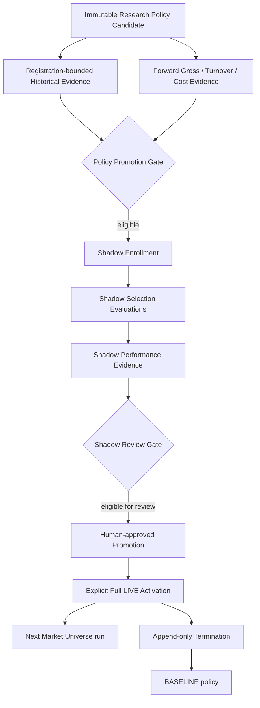

# Ranking Policy Promotion

이 문서는 immutable Research Policy Candidate가 Shadow evidence와 사람의 승인을 거쳐 Full LIVE ranking policy로 활성화되는 lifecycle의 source of truth입니다. 연구 방법은 [STRATEGY_RESEARCH.md](STRATEGY_RESEARCH.md)를 참고하세요.

Python CLI는 repository root에서 `cd trading-engine`한 뒤 실행합니다. 권장 형식은 `uv run python -m scripts.<module> ...`이며, 아래의 `python -m` 예시는 engine 가상환경이 활성화된 경우의 축약형입니다.

## 핵심 경계

```text
Evidence != Decision
Gate eligibility != Enrollment
Shadow review eligibility != Human approval
Human approval != Full LIVE activation
Code deployment != Policy activation
Policy activation != Order
```

어떤 연구 command도 Upbit 주문을 만들지 않습니다. Full LIVE activation도 주문을 만들지 않고 다음 Market Universe 분석에서 사용할 ranking policy만 선택합니다. OpenAI recommendation, Telegram approval, order limits, Order Chance, idempotency와 reconciliation은 그대로 유지됩니다.

## Lifecycle



## Candidate와 registration boundary

`ResearchPolicyCandidate`는 scenario definition, component weights, baseline policy signature, effective Top N, reference snapshot lineage와 registration watermarks를 immutable하게 저장합니다. 동일 context/definition 재실행은 기존 row를 검증해 반환하고 alias/conflict는 거부합니다.

Historical evidence는 registration 당시 알 수 있었던 source만 사용하고 genuine Forward evidence는 strict triple-cutoff 이후 snapshot만 사용합니다. Candidate row와 canonical signature가 source of truth이며 scenario file을 나중에 다시 해석하지 않습니다.

## Policy Promotion Gate

`PolicyPromotionGateService`는 하나의 candidate에 대해 bounded Historical evidence와 Forward Gross/Turnover/Cost-adjusted evidence를 함께 검증합니다. Result는 다음을 구분합니다.

- `INVALID_PROMOTION_DATA`: lineage, signature, chronology 또는 identity 위반
- `INSUFFICIENT_DATA`: 관찰 기간이나 표본 부족
- `NOT_ELIGIBLE`: 충분한 표본에서 고정 engineering threshold 미충족
- `ELIGIBLE_FOR_REVIEW`: Shadow 검토 시작 자격 충족

Gate는 deterministic engineering guardrail이며 통계적 유의성 검정이 아닙니다. 실행 시작 시 broad Forward context ceiling을 한 번 고정해 component가 같은 표본 시점을 사용합니다. CLI는 policy threshold/as-of override를 받지 않습니다.

```bash
cd trading-engine
python -m scripts.evaluate_policy_promotion_gate --candidate-id <ID>
```

Gate는 DB write, external API, enrollment, runtime policy 변경이나 주문을 수행하지 않습니다.

## Shadow Enrollment

신규 enrollment의 preview/apply는 current Policy Promotion Gate를 fresh evaluation하고 정확히 eligible인 candidate만 immutable Shadow 시작 anchor로 등록합니다. Candidate마다 enrollment는 하나입니다. 이미 정상 enrollment가 존재하면 기존 row와 provenance를 검증하고 Gate를 다시 평가하지 않은 채 `ALREADY_ENROLLED`를 반환합니다. 신규 row에는 Gate policy/check/evidence provenance와 decision signature를 저장하며, Gate와 enrollment 사이에 생긴 snapshot도 새 watermark에 포함해 Shadow evidence에서 제외합니다.

```bash
python -m scripts.enroll_shadow_policy --candidate-id <ID>
python -m scripts.enroll_shadow_policy --candidate-id <ID> --apply
```

Enrollment는 runtime activation이 아니며 Market Universe, AI, Telegram, 주문 또는 LIVE policy를 바꾸지 않습니다.

## Shadow Selection

`ShadowPolicyEvaluationService`는 enrollment의 ID/captured/time watermarks를 모두 strict `>`로 통과한 snapshot만 candidate policy로 offline replay합니다. 같은 dataset의 broad timeline을 먼저 고정하고 baseline/Top N mismatch와 replay failure도 immutable marker로 저장해 앞뒤 chronology를 인위적으로 연결하지 않습니다.

```bash
python -m scripts.evaluate_shadow_policy_selection --candidate-id <ID>
python -m scripts.evaluate_shadow_policy_selection --candidate-id <ID> --apply
```

Preview는 write가 없고 apply는 selection evidence만 저장합니다. `recommendation-outcome-worker`는 `SHADOW_SELECTION_EVALUATION_ENABLED=true`일 때 기존 enrollment를 자동 평가할 수 있지만 enrollment나 promotion은 자동 생성하지 않습니다.

## Shadow Performance

저장된 baseline/shadow Top N과 existing candidate outcome을 결합해 Gross, Turnover, Cost-adjusted evidence를 조회 시점에 계산합니다. Selection을 다시 계산하지 않고 performance row를 저장하지 않습니다. 한 invocation의 as-of와 evaluation ceiling을 component 전체가 공유합니다.

```bash
python -m scripts.evaluate_shadow_policy_performance \
  --candidate-id <ID> \
  --horizon 60 --horizon 240 --horizon 1440 \
  --fee-rate 0.0005 --spread-cost-rate 0.0005 --slippage-rate 0.001
```

Context mismatch나 replay failure는 continuity break이며 첫 valid selection에는 이전 turnover/cost를 붙이지 않습니다.

## Shadow Review Gate

`ShadowReviewGateService`는 enrollment에 동결된 pre-Shadow provenance를 검증하고 immutable Shadow Performance Evidence에 고정된 policy를 적용합니다. Historical/Forward evidence나 Offline Replay를 다시 실행하지 않습니다.

Result는 invalid, insufficient, fail, eligible-for-promotion-review를 구분합니다. Eligible은 사람이 검토할 수 있다는 의미일 뿐 자동 promotion이 아닙니다.

```bash
python -m scripts.evaluate_shadow_review_gate --candidate-id <ID>
```

Gate는 DB write, external call, runtime 또는 LIVE 변경을 하지 않습니다.

## Human-approved Promotion

사람이 preview의 exact review decision signature와 evidence를 확인한 뒤에만 immutable approval row를 기록합니다. Apply는 Review Gate를 다시 평가하며 signature가 달라지면 `REVIEW_DECISION_CHANGED`로 fail-closed합니다. `--force` 우회는 없습니다.

```bash
# Preview
python -m scripts.approve_shadow_policy_promotion --candidate-id <ID>

# Apply
python -m scripts.approve_shadow_policy_promotion \
  --candidate-id <ID> \
  --expected-review-decision-signature "<EXACT_SIGNATURE_FROM_PREVIEW>" \
  --apply
```

Approval은 최종 사람 감사 기록이지만 activation은 아닙니다. Ranking runtime, scheduler, order path를 변경하지 않습니다.

## Full LIVE Activation

Full LIVE activation은 현재 구현된 explicit operator action입니다. 승인된 `ShadowPolicyPromotionApproval`을 source로 user/exchange/quote scope에 하나의 활성 policy를 기록합니다.

```bash
# Preview
python -m scripts.activate_full_live_policy \
  --promotion-approval-id <APPROVAL_ID> \
  --user-id <USER_ID> --exchange UPBIT --quote-asset KRW

# Apply
python -m scripts.activate_full_live_policy \
  --promotion-approval-id <APPROVAL_ID> \
  --user-id <USER_ID> --exchange UPBIT --quote-asset KRW \
  --expected-approval-signature "<SIGNATURE_FROM_PREVIEW>" \
  --apply
```

Apply 전에 Production DB를 백업하고 preview signature, scope, active policy 부재와 approval provenance를 사람이 확인해야 합니다. Activation은 order를 만들거나 기존 recommendation을 재실행하지 않습니다. 다음 Market Universe build에서 resolver가 해당 policy를 검증한 뒤 사용합니다.

현재 effective policy는 read-only로 확인합니다.

```bash
python -m scripts.check_live_ranking_policy \
  --user-id <USER_ID> --exchange UPBIT --quote-asset KRW
```

Active activation이 없거나 종료됐다면 BASELINE이 정상 결과입니다.

## Full LIVE Termination

종료는 activation row를 수정하거나 삭제하지 않습니다. Exact activation signature를 preview/apply 사이에 확인하고 immutable termination event를 append합니다. 다음 resolution은 BASELINE으로 돌아갑니다.

```bash
# Preview
python -m scripts.stop_full_live_policy \
  --activation-id <ACTIVATION_ID> \
  --user-id <USER_ID> --exchange UPBIT --quote-asset KRW

# Apply
python -m scripts.stop_full_live_policy \
  --activation-id <ACTIVATION_ID> \
  --user-id <USER_ID> --exchange UPBIT --quote-asset KRW \
  --expected-activation-signature "<SIGNATURE_FROM_PREVIEW>" \
  --reason "operator decision" --apply
```

Termination도 order 취소나 기존 LIVE order mutation을 수행하지 않습니다. 기존 order는 reconciliation과 runbook 절차로 별도 관리합니다.

## 단계별 side effect

| 단계 | DB write | External API | Runtime ranking 변경 | Order 생성 |
| --- | --- | --- | --- | --- |
| Historical/Forward evidence | 없음 | 없음 | 없음 | 없음 |
| Promotion Gate | 없음 | 없음 | 없음 | 없음 |
| Shadow Enrollment preview | 없음 | 없음 | 없음 | 없음 |
| Shadow Enrollment apply | enrollment INSERT | 없음 | 없음 | 없음 |
| Shadow Selection apply | evaluation INSERT | 없음 | 없음 | 없음 |
| Shadow Performance/Review | 없음 | 없음 | 없음 | 없음 |
| Human Approval apply | approval INSERT | 없음 | 없음 | 없음 |
| Full LIVE Activation apply | activation INSERT | 없음 | 다음 분석부터 | 없음 |
| Full LIVE Termination apply | termination INSERT | 없음 | BASELINE 복귀 | 없음 |

## Integrity와 concurrency

- Candidate, enrollment, evaluation, approval와 activation provenance는 canonical signature로 검증합니다.
- Preview/apply는 exact expected signature로 source 변경을 탐지합니다.
- Unique constraint와 conflict handling이 동일 command의 중복 row를 막습니다.
- Watermark, timezone-aware as-of와 maximum ID ceiling이 실행 중 추가된 snapshot 혼입을 막습니다.
- Context mismatch와 invalid integrity는 누락시키지 않고 fail-closed status로 남깁니다.

## 현재 promotion model

현재 lifecycle에는 Canary runtime이 없습니다. Migration history의 Canary table은 과거 schema이고 cleanup migration이 promotion flow를 제거했습니다. 현재 경로는 Shadow human approval 뒤 운영자의 explicit Full LIVE activation입니다.

환경별 candidate ID나 현재 Production row 상태는 이 문서의 계약이 아닙니다. 현재 상태는 diagnostic CLI와 해당 DB에서 확인합니다.
